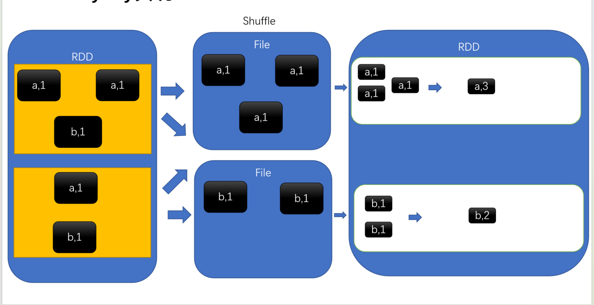
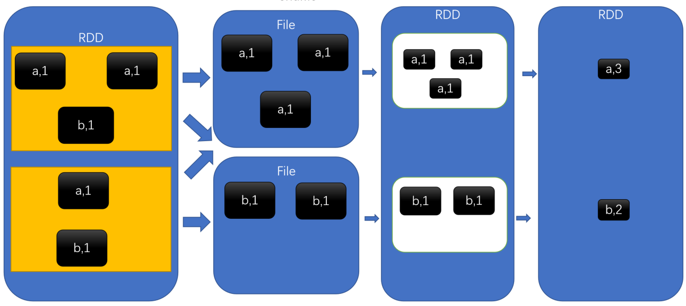
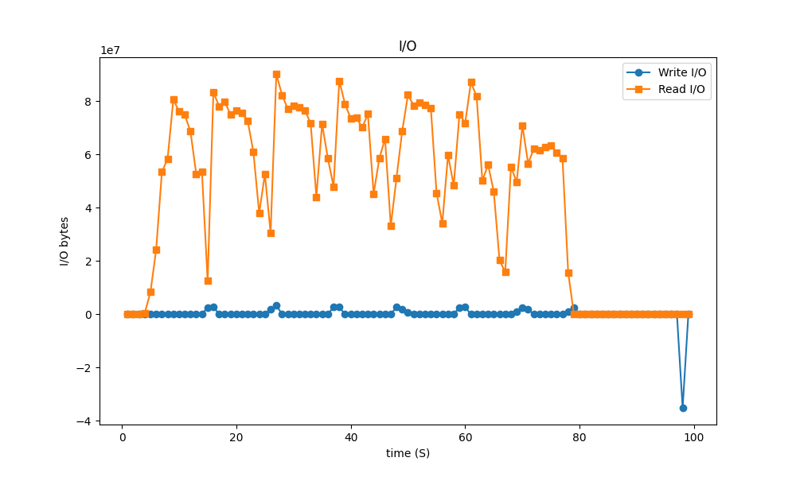
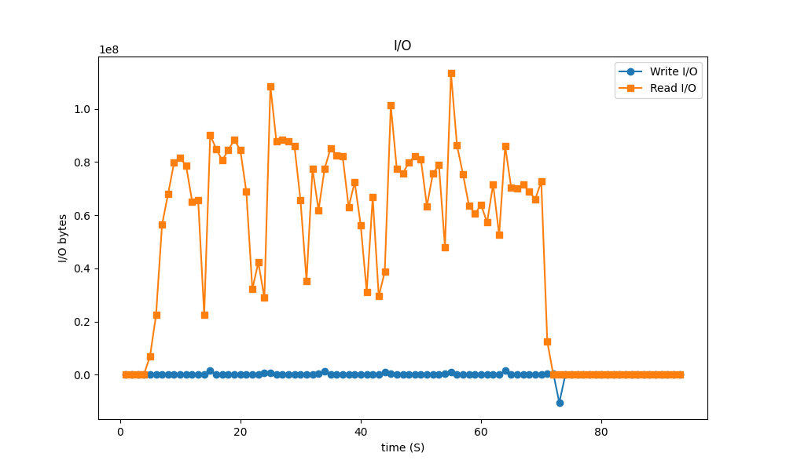
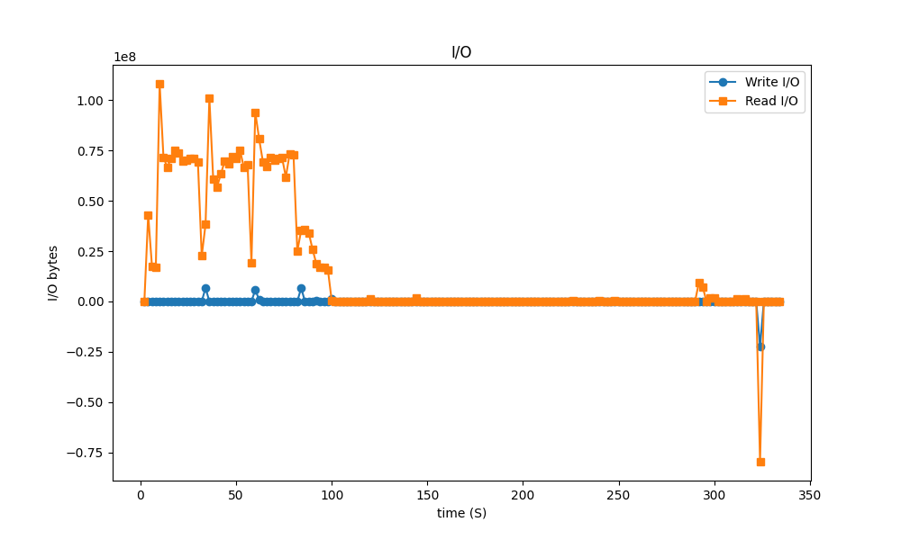
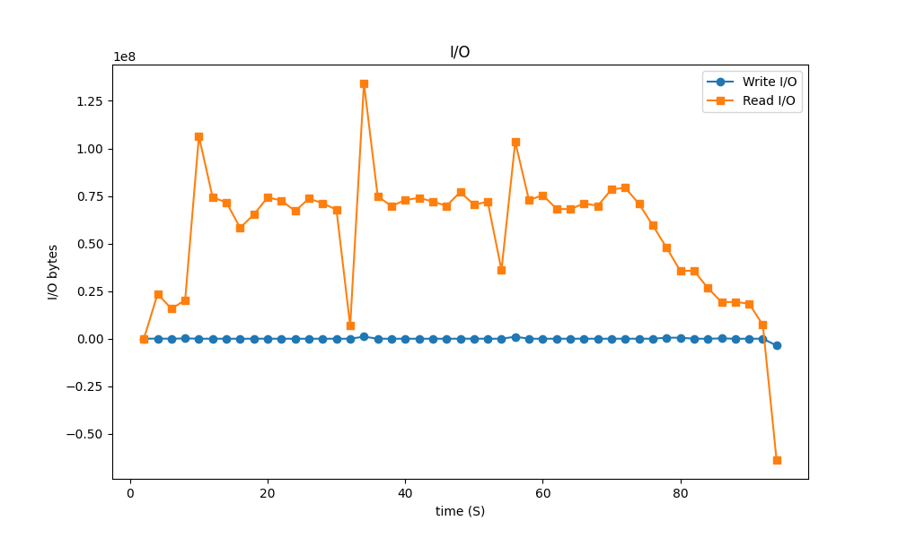

# 实验探究
在 Spark 计算框架中，
reduceByKey 和 groupByKey 这两个算子均可用于达成某些相似的功能。

为深入探究二者在实现相同功能时所呈现出的性能差异，
以及造成这种性能差异的具体原因，现设计相关实验进行研究分析。
# 实验环境配置
ubuntu + spark + hdfs

## 部署hdfs
### 运行hdfs
[下载hadoop](https://hadoop.apache.org/releases.html)

下载好之后解压到工作目录
执行如下操作
```
vim /etc/profile
```

将下面的内容复制到文件末尾
```
export HADOOP_HOME=/home/pink/hadoop/source/hadoop-3.4.1
export PATH=$HADOOP_HOME/bin:$PATH
```

免密登录
```
cp ~/.ssh/id_rsa.pub ~/.ssh/authorized_keys 
```

将本仓库文件夹`conf`中的`core-site.xml`和`hdfs-site.xml`复制到`${HADOOP_HOME}/etc/hadoop`下面

执行命令
```
hdfs namenode -format
start-dfs.sh
```

### 数据集
这里有三个数据集，大小分别约为 0.16mb, 5GB, 10GB
```
hdfs dfs -mkdir /input
cd dataset
bash generate_super_large_dataset.sh
hdfs dfs -put ./dataset.txt /input
hdfs dfs -put ./large_dataset.txt /input
hdfs dfs -put ./super_large_dataset.txt /input
```
查看数据集
```
hdfs dfs -ls /input
```


## Spark
[下载Spark](https://spark.apache.org/downloads.html)

同样解压在工作目录，再将其导入环境变量中去。
```
vim /etc/profile
```
复制下面数据进去
```
export SPARK_HOME=/home/pink/hadoop/spark/spark-3.5.3-bin-hadoop3
export PATH=$SPARK_HOME/bin:$PATH
```

执行命令
```
source /etc/profile
```
命令行中执行，检查是否有问题
```
pyspark
```
会出现部分输出如下

# 实验设计
实现两个相同功能的程序，一个使用`reduceByKey`实现，另外一个使用`groupByKey`实现，都运行相同的数据集，对比性能差异，使用`monitor`文件夹中程序动态观测程序运行时产生的读写I/O大小和spark UI来观测两个程序之间产生的性能差异，分析其背后产生差异的原因, 设计实验来验证是否猜想是否正确。

## 观测性能差异
实验使用的文本数据集合，数据集大小为5GB，实现了两个WordCount程序，分别测量时间，
* reduceByKey的实现的运行平均时间是:2分钟19秒
* groupByKey+map的实现的运行平均时间是：3分钟21秒。
两者性能差距过大，相差接近30%。

## 造成差异的原因

`reduceByKey`将数据分词后，进入Shuffle阶段，从Shuffle阶段到后一步统计词频时，对一种元组，只需要保存一个Key Value Pair。


`groupByKey` + `Map`将数据分词后，`Shuffle`阶段结束之后，集合也是按照Key Value Pair保存，但是对一种元组，KVPair的数量是这个元组在数据集中出现的数量，然后再进行Map操作，获得结果。

对比上述流程可以知道，面对大量重复单词时，`groupByKey` + `Map`的解决方案性能会远远低于`reduceByKey`的实现。

用python实现的I/O检测程序检测两个Spark程序的I/O（monitor目录下面），

横轴是时间(底下横轴需要×2，才是实际时间)，纵轴是I/O吞吐：
### groupByKey


### reduceByKey


## 设计实验验证猜想
设计了一个倾斜的数据集合，具有大量重复的单词，在`dataset`下，用下面命令生成
```
python3 generate_skew_dataset.py
bash generate_large_skew_dataset.sh
```
再跑上述实验

在数据倾斜的时候，两者性能差距非常大。

groupByKey 平均时间 5m32s

reduceByKey + Map 平均时间 1m13s

### groupByKey


### reduceByKey
